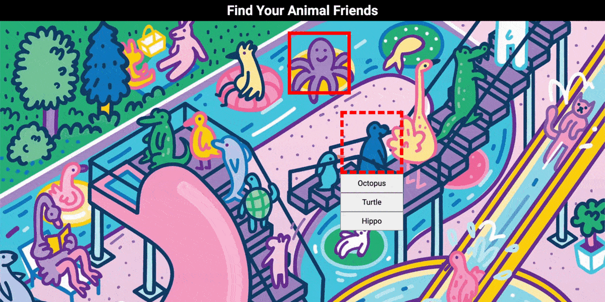

# Where's Walter?
A React Photo Tagging Game using Firebase to keep leaderboard scores.  
[Live Demo](https://lemuellin.github.io/photo-tagging-app/) :point_left:



## Features
-	Real-time verification of characters, and game status with Firebase Firestore
-	Global leaderboard without login
-	Mobile Responsive

## Technologies
-	React
-	React Router
-	Firebase's Firestore

## Getting Started
##### Install and Run
```
git clone https://git@github.com:lemuellin/photo-tagging-app.git
cd photo-tagging-app
npm install
npm start
```